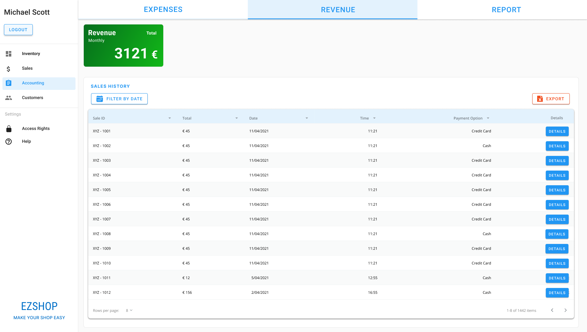
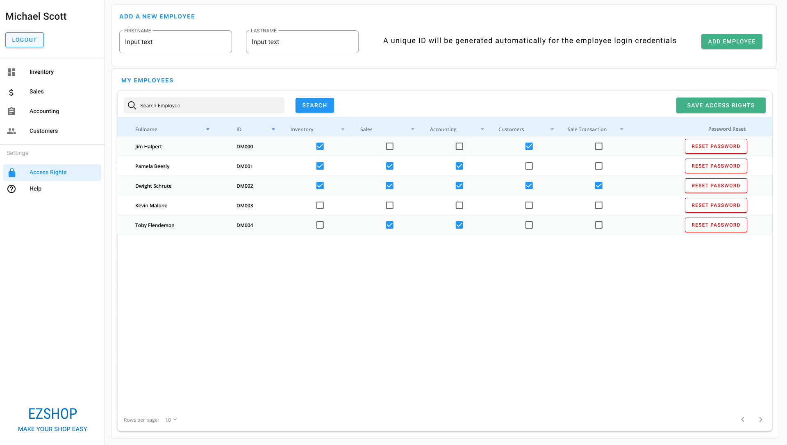

# Graphical User Interface Prototype

Authors: Diego Marino, Michele Massetti, Mohamed Shehab, Elisa Tedde

Date: 21/04/2021

Version: 1.0

# Screenshots

## Screenshot 1: Log in

The EZShop application starts with screenshot 1.

- Employees with ID and password log into the application by inserting their credentials;
- New employees without ID have to ask for their ID to the owner; after receiving it, the employee sets his own password during the sign up phase;
- Employees who forget their password have to contact the owner to reset it and then they can sign up again; during the sign up phase, the employees set their new password;
- If the owner forgets his password, he needs to contact EZShop support.

<table>
<tbody>
  <tr>
    <td></td>
    <td></td>
    </tr><tr>
    <td></td>
  </tr>
</tbody>
</table>

## Screenshot 2: Inventory

In this section the employee manages the items in the inventory.

- _Add item_: the employee can add a new item, populating the fields with its details;
- _Edit item_: the employee can modify some fields or add some optional info such as _category_, _discount_ or _quantity alert threshold_. Then he has to save his changes to update the item;
- _Search item_: the employee can search an item by typing its SKU or description; he can also filter by category to obtain a subset of items. If the search returns no results, he needs to adjust his search.
- _Delete item_: the employee can delete an item by opening the item details and clicking the `DELETE` button.

<table>
  <tbody>
    <tr>
      <td></td>
      <td></td>
      </tr>
      <tr>
      <td></td>
      <td></td>
    </tr>
    <tr>
      <td></td>
    </tr>
  </tbody>
  </table>

## Screenshot 3: Sales

In this section the employee consults some daily statistics.

It provides:

- The sales history of the current day with some details;
- The number of sales and the total income of the current day;
- Monthly, hourly sales chart;
- Top categories by number of sales chart;
- Payment options chart.

<table>
<tbody>
  <tr>
    <td></td>
  </tr>
</tbody>
</table>

## Screenshot 3: Accounting

This section is divided into 3 parts: expenses, revenue and report. Here the employee manages the EZShop accounting.

- Expenses part: the employee can consult the total monthly cost (fixed and variable expenses are also available). Additionally, he can add a new expense and search it using some filters. He can also export this info to a spreadsheet file;
- Revenue part: the employee can consult the monthly revenue with all details selecting the appropriate time windows;
- Report part: it is shown some economical measures such as profit.

<table>
<tbody>
  <tr>
    <td></td>
    <td></td></tr><tr>
    <td></td>
  </tr>
</tbody>
</table>

## Screenshot 4: Sale Register

This section enables the cashier to manage a sale transaction.

- The cashier links the sale to the fidelity card (if it is provided by the customer), by tapping the `FIDELITY CARD` button and scanning it with the barcode reader;
- The cashier can reset the payment option without voiding the transaction;
- If the customer is unable to complete the transaction+ right away, the cashier can put a sale transaction on hold and proceed with the next one; he can then recall the transaction from hold to resume it;
- The cashier can void the entire order with the `VOID` button.

This UI is touch-friendly, so that it can be used both with mouse and keyboard and with a modern touchscreen device.

<table>
<tbody>
  <tr>
    <td></td>
    <td></td></tr><tr>
    <td></td>
    <td></td>
  </tr>
</tbody>
</table>

## Screenshot 5: Customer

In this section the employee manages customers data.

- _Add customer_: the employee can add a new customer, populating the fields with its details. Additionally, he can link it with a fidelity card;
- _Edit customer_: the employee can modify the customer details;
- _Search a customer_: the employee can search a customer by typing his name or fidelity card number, or automatically by scanning the customer's fidelity card.
- _Delete customer_: the employee can delete a customer by opening the customer details and clicking the `DELETE` button.

The owner decides the threshold of points and the respective discount of the loyalty program: when the customer has enough fidelity points, the discount is automatically applied to his next order.

<table>
<tbody>
  <tr>
    <td></td>
    <td></td></tr><tr>
    <td></td>
  </tr>
</tbody>
</table>

## Screenshot 6: Access Rights

The following section allows the owner to manage the employees profile: he can create a new employee profile or delete one; here he can set an employee's access rights.

The owner can also reset the password of an employee profile.

<table>
<tbody>
  <tr>
    <td></td>
    <td></td></tr>
</tbody>
</table>

# Navigation map

 
  
Click to show the Navigation map

