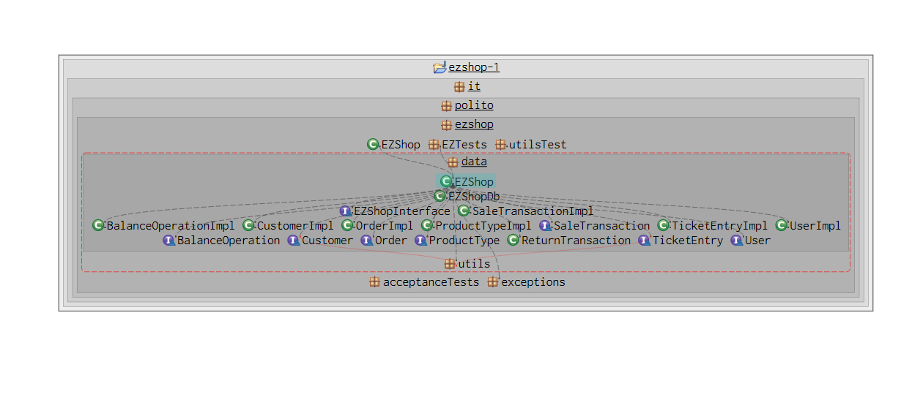

# Integration and API Test Documentation

Authors: Diego Marino, Michele Massetti, Elisa Tedde

Date: 26/05/2021

Version: 1.0

# Contents

- [Dependency graph](#dependency graph)

- [Integration and API Test Documentation](#integration-and-api-test-documentation)
- [Contents](#contents)
- [Dependency graph](#dependency-graph)
- [Integration approach](#integration-approach)
- [Tests](#tests)
  - [Step 1](#step-1)
  - [Step 2](#step-2)
  - [Step 3](#step-3)
- [Scenarios](#scenarios)
  - [Scenario UCx.y](#scenario-ucxy)
- [Coverage of Scenarios and FR](#coverage-of-scenarios-and-fr)
- [Coverage of Non Functional Requirements](#coverage-of-non-functional-requirements)

- [Tests](#tests)

- [Scenarios](#scenarios)

- [Coverage of scenarios and FR](#scenario-coverage)
- [Coverage of non-functional requirements](#nfr-coverage)

# Dependency graph

     <report the here the dependency graph of the classes in EzShop, using plantuml>

  

# Integration approach

    <Write here the integration sequence you adopted, in general terms (top down, bottom up, mixed) and as sequence
    (ex: step1: class A, step 2: class A+B, step 3: class A+B+C, etc)>
    <Some steps may  correspond to unit testing (ex step1 in ex above), presented in other document UnitTestReport.md>
    <One step will  correspond to API testing>

| Step  | Classes                                                                                                      |
| ----- | ------------------------------------------------------------------------------------------------------------ |
| step1 | User, Order, Customer, BalanceOperation, TicketEntry, ProductType, ReturnTransaction, SaleTransaction, Utils |
| step2 | step1 + EZShopDB                                                                                             |
| step3 | step1 + step2 + EZShop                                                                                       |

# Tests

<define below a table for each integration step. For each integration step report the group of classes under test, and the names of
JUnit test cases applied to them> JUnit test classes should be here src/test/java/it/polito/ezshop

## Step 1

| Classes           | JUnit test cases                |
| ----------------- | ------------------------------- |
| User              | testSetGetId()                  |
| User              | testSetGetUsername()            |
| User              | testSetGetPassword()            |
| User              | testSetGetRole()                |
| Order             | testGetSetProductCode()         |
| Order             | testGetSetPrice()               |
| Order             | testGetSetQuantity()            |
| Order             | testGetSetStatus()              |
| Order             | testGetSetBalanceID()           |
| Order             | testGetSetOrderID()             |
| Customer          | testGetSetCustomerName()        |
| Customer          | testSetGetCustomerCard()        |
| Customer          | testSetGetID()                  |
| Customer          | testSetGetPoints()              |
| BalanceOperation  | testGetSetBalanceID()           |
| BalanceOperation  | testGetSetDate()                |
| BalanceOperation  | testGetSetMoney()               |
| BalanceOperation  | testGetSetType()                |
| TicketEntry       | testGetSetBarCode()             |
| TicketEntry       | testGetSetPrice()               |
| TicketEntry       | testGetSetQuantity()            |
| TicketEntry       | testGetSetProductDescription()  |
| TicketEntry       | testGetSetDiscountRate()        |
| ProductType       | testSetGetQuantity()            |
| ProductType       | testSetGetLocation()            |
| ProductType       | testSetGetNote()                |
| ProductType       | testSetGetProductDescription()  |
| ProductType       | testSetGetBarCode()             |
| ProductType       | testSetGetPricePerUnit()        |
| ProductType       | testSetGetId()                  |
| ReturnTransaction | testGetSetReturnId()            |
| ReturnTransaction | testGetSetTransactionId()       |
| ReturnTransaction | testGetSetStatus()              |
| ReturnTransaction | testGetSetTotal()               |
| ReturnTransaction | testUpdateTotal()               |
| ReturnTransaction | testGetSetReturnedProductMap()  |
| ReturnTransaction | testAddProductToReturn()        |
| SaleTransaction   | testGetSetTransactionId()       |
| SaleTransaction   | testGetSetStatus()              |
| SaleTransaction   | testGetSetPrice()               |
| SaleTransaction   | testGetSetDiscountRate()        |
| Utils             | testValidBarcode()              |
| Utils             | testInvalidBarcode()            |
| Utils             | WBtestInvalidLengthBarCode()    |
| Utils             | WBtestInvalidDigitBarCode()     |
| Utils             | testOnlyDigit()                 |
| Utils             | testNotOnlyDigit()              |
| Utils             | testValidLuhnCreditCard()       |
| Utils             | WBtestInvalidLengthCreditCard() |
| Utils             | testInvalidLuhnCreditCard()     |
| Utils             | testRegisteredCreditCard()      |
| Utils             | WBtestInvalidAmountCreditCard() |
| Utils             | testInvalidLuhnCreditCard()     |
| Utils             | testRegisteredCreditCard()      |
| Utils             | WBtestInvalidAmountCreditCard() |
| Utils             | testUnregisteredCreditCard()    |
| Utils             | testValidUpdateFile()           |
| Utils             | WBtestInvalidUFile()            |
| Utils             | testInvalidUpdateFile()         |

## Step 2

| Classes         | JUnit test cases                             |
| --------------- | -------------------------------------------- |
| SaleTransaction | testSetGetEntries()                          |
| SaleTransaction | testEstimatePrice()                          |
| EZShopDB        | testValidInsertOrder()                       |
| EZShopDB        | testInvalidInsertOrder()                     |
| EZShopDB        | testValidGetOrder()                          |
| EZShopDB        | testInvalidGetOrder()                        |
| EZShopDB        | testValidGetAllOrders()                      |
| EZShopDB        | testInvalidGetAllOrders()                    |
| EZShopDB        | testUpdateOrder()                            |
| EZShopDB        | testInvalidUpdateOrder()                     |
| EZShopDB        | testGetUserbyName()                          |
| EZShopDB        | testInvalidGetUserbyName()                   |
| EZShopDB        | testUpdateUserRights()                       |
| EZShopDB        | testInvalidUpdateUserRights()                |
| EZShopDB        | testDeleteUser()                             |
| EZShopDB        | testInvalidDeleteUser()                      |
| EZShopDB        | testGetAllUser()                             |
| EZShopDB        | testGetUser()                                |
| EZShopDB        | testInvalidInsertCard()                      |
| EZShopDB        | testUpdateCustomer()                         |
| EZShopDB        | testInvalidUpdateCustomer()                  |
| EZShopDB        | testCustomerCard()                           |
| EZShopDB        | testInvalidGetCustomerCard()                 |
| EZShopDB        | testValidGetCustomerCardNumber()             |
| EZShopDB        | testInvalidGetCustomerCardNumber()           |
| EZShopDB        | testValidGetCustomer()                       |
| EZShopDB        | testInvalidGetCustomer()                     |
| EZShopDB        | testValidAttachCard()                        |
| EZShopDB        | testInvalidAttachCard()                      |
| EZShopDB        | testValidGetAllCustomers()                   |
| EZShopDB        | testInvalidGetAllCustomers()                 |
| EZShopDB        | testValidDeleteCustomer()                    |
| EZShopDB        | testInvalidDeleteCustomer()                  |
| EZShopDB        | testValidGetCustomerByCard()                 |
| EZShopDB        | testInvalidGetCustomerByCard()               |
| EZShopDB        | testValidInsertBalanceOperation()            |
| EZShopDB        | testInvalidInsertBalanceOperation()          |
| EZShopDB        | testValidGetBalance()                        |
| EZShopDB        | testInvalidGetBalance()                      |
| EZShopDB        | testValidRecordBalanceUpdate()               |
| EZShopDB        | testInvalidRecordBalanceUpdate()             |
| EZShopDB        | testgetFromAllBalanceOperations()            |
| EZShopDB        | testgetToAllBalanceOperations()              |
| EZShopDB        | testgetFromToAllBalanceOperations()          |
| EZShopDB        | testgetAllBalanceOperations()                |
| EZShopDB        | testInvalidgetAllBalanceOperations()         |
| EZShopDB        | testSetGetEntries()                          |
| EZShopDB        | testEstimatePrice()                          |
| EZShopDB        | testValidGetReturnTransaction()              |
| EZShopDB        | testNullGetReturnTransaction()               |
| EZShopDB        | testInvalidGetReturnTransaction()            |
| EZShopDB        | testValidDeleteReturnTransaction()           |
| EZShopDB        | testInvalidDeleteReturnTransaction()         |
| EZShopDB        | testValidNewReturnTransactionId()            |
| EZShopDB        | testInvalidNewReturnTransactionId()          |
| EZShopDB        | testValidGetSaleTransaction()                |
| EZShopDB        | testNullGetSaleTransaction()                 |
| EZShopDB        | testInvalidGetSaleTransaction()              |
| EZShopDB        | testValidUpdateSaleTransaction()             |
| EZShopDB        | testInvalidUpdateSaleTransaction()           |
| EZShopDB        | testValidDeleteSaleTransaction()             |
| EZShopDB        | testInvalidDeleteSaleTransaction()           |
| EZShopDB        | testValidPayForSaleTransaction()             |
| EZShopDB        | testInvalidPayForSaleTransaction()           |
| EZShopDB        | testValidSetSaleDiscount()                   |
| EZShopDB        | testInvalidSetSaleDiscount()                 |
| EZShopDB        | testValidNewSaleTransactionId()              |
| EZShopDB        | testInvalidNewSaleTransactionId()            |
| EZShopDB        | testUpdateProd()                             |
| EZShopDB        | testInvalidUpdateProd()                      |
| EZShopDB        | testUpdateQuant()                            |
| EZShopDB        | testInvalidUpdateQuant()                     |
| EZShopDB        | testInvalidUpdatePosition()                  |
| EZShopDB        | testPosition()                               |
| EZShopDB        | testInvalidExistingPosition()                |
| EZShopDB        | testDeleteProd()                             |
| EZShopDB        | testInvalidDeleteProd()                      |
| EZShopDB        | testGetAllProductypes()                      |
| EZShopDB        | testGetgetProductTypesByDescription()        |
| EZShopDB        | testInvalidGetgetProductTypesByDescription() |
| EZShopDB        | testGetProductById()                         |
| EZShopDB        | getProductTypeByBarCode()                    |
| EZShopDB        | testValidPayForReturnTransaction()           |
| EZShopDB        | testInvalidPayForReturnTransaction()         |
| Utils           | testContainsProduct()                        |
| Utils           | testDoesntContainProduct()                   |
| Utils           | testGetProductFromEntries()                  |
| Utils           | testValidContainsCustomer()                  |
| Utils           | testInvalidContainsCustomer()                |

## Step 3

| Classes | JUnit test cases                        |
| ------- | --------------------------------------- |
| EZShop  | testValidComputePointsForSale()         |
| EZShop  | testInvalidStartSaleTransaction()       |
| EZShop  | testValidStartSaleTransaction()         |
| EZShop  | testInvalidAddProductToSale()           |
| EZShop  | testValidAddProductToSale()             |
| EZShop  | testInvalidDeleteProductFromSale()      |
| EZShop  | testInvalidApplyDiscountRateToProduct() |
| EZShop  | testValidApplyDiscountRateToProduct()   |
| EZShop  | testInvalidApplyDiscountRateToSale()    |
| EZShop  | testValidApplyDiscountRateToSale()      |
| EZShop  | testInvalidComputePointsForSale()       |
| EZShop  | testInvalidEndSaleTransaction()         |
| EZShop  | testValidEndSaleTransaction()           |
| EZShop  | testInvalidDeleteSaleTransaction()      |
| EZShop  | testValidDeleteSaleTransaction()        |
| EZShop  | testInvalidGetSaleTransaction()         |
| EZShop  | testValidGetSaleTransaction()           |
| EZShop  | testInvalidReceiveCashPayment()         |
| EZShop  | testValidReceiveCashPayment()           |
| EZShop  | testInvalidReceiveCreditCardPayment()   |
| EZShop  | testValidReceiveCreditCardPayment()     |
| EZShop  | testInvalidStartReturnTransaction()     |
| EZShop  | testValidStartReturnTransaction()       |
| EZShop  | testInvalidReturnProduct()              |
| EZShop  | testValidReturnProduct()                |
| EZShop  | testInvalidEndReturnTransaction()       |
| EZShop  | testValidEndReturnTransaction()         |
| EZShop  | testInvalidDeleteReturnTransaction()    |
| EZShop  | testValidDeleteReturnTransaction()      |
| EZShop  | testInvalidReturnCashPayment()          |
| EZShop  | testValidReturnCashPayment()            |
| EZShop  | testInvalidReturnCreditCardPayment()    |
| EZShop  | testValidReturnCreditCardPayment()      |
| EZShop  | testValidIssueOrder()                   |
| EZShop  | testInvalidIssueOrder()                 |
| EZShop  | testValidPayOrderFor()                  |
| EZShop  | testInvalidPayOrderFor()                |
| EZShop  | testValidPayOrder()                     |
| EZShop  | testInvalidPayOrder()                   |
| EZShop  | testValidRecordOrderArrival()           |
| EZShop  | testInvalidRecordOrderArrival()         |
| EZShop  | testValidGetAllOrders()                 |
| EZShop  | testInvalidGetAllOrders()               |
| EZShop  | testValidDefineCustomer()               |
| EZShop  | testInvalidDefineCustomer()             |
| EZShop  | testValidModifyCustomer()               |
| EZShop  | testInvalidModifyCustomer()             |
| EZShop  | testValidDeleteCustomer()               |
| EZShop  | testInvalidDeleteCustomer()             |
| EZShop  | testValidGetCustomer()                  |
| EZShop  | testInvalidGetCustomer()                |
| EZShop  | testValidGetAllCustomer()               |
| EZShop  | testInvalidGetAllCustomer()             |
| EZShop  | testValidCreateCard()                   |
| EZShop  | testInvalidCreateCard()                 |
| EZShop  | testValidAttachCardToCustomer()         |
| EZShop  | testInvalidAttachCardToCustomer()       |
| EZShop  | testValidModifyPointsOnCard()           |
| EZShop  | testInvalidModifyPointsOnCard()         |
| EZShop  | testInvalidRecordBalanceUpdate()        |
| EZShop  | testValidRecordBalanceUpdate()          |
| EZShop  | testGetCreditsAndDebits()               |
| EZShop  | testComputeBalance()                    |
| EZShop  | testValidCreateUser()                   |
| EZShop  | testInvalidCreateUser()                 |
| EZShop  | testValidDeleteUser()                   |
| EZShop  | testInValidDeleteUser()                 |
| EZShop  | testValidGetAllUsers()                  |
| EZShop  | testInvaldGetAllUsers()                 |
| EZShop  | testValidGetUser()                      |
| EZShop  | testInvalidGetUser()                    |
| EZShop  | testValidupdateUserRights()             |
| EZShop  | testInvalidupdateUserRights()           |
| EZShop  | testValidLogin()                        |
| EZShop  | testInvalidLogin()                      |
| EZShop  | testValidlogout()                       |
| EZShop  | testValidCreateProductType()            |
| EZShop  | testInvalidCreateProductType()          |
| EZShop  | testValidUpdateProduct()                |
| EZShop  | testInvalidUpdateProduct()              |
| EZShop  | testValidDeleteProductType()            |
| EZShop  | testInvalidDeleteProductType()          |
| EZShop  | testValidGetAllProductTypes()           |
| EZShop  | testInvalidGetAllProductTypes()         |
| EZShop  | testValidGetProductTypeByBarCode()      |
| EZShop  | testInvalidGetProductTypeByBarCode()    |
| EZShop  | testValidgetProductTypesByDescription() |
| EZShop  | testValidUpdatePostion()                |
| EZShop  | testInValidUpdatePosition()             |
| EZShop  | testValidUpdateQuantity()               |
| EZShop  | testInalidUpdateQuantity()              |
| EZShop  |testValidRecordOrderArrivalRFID()        |
| EZShop  |testInvalidRecordOrderArrivalRFID()      |
| EZShop  |testInvalidReturnProdRFID()              |
| EZShop  |testValidReturnProdRFID()                | 
| EZShop  |testValidAddProductToSaleRFID()          |
| EZShop  |testInvalidAddProductToSalebyRFID()      |
| EZShop  |testInvalidDeleteProductFromSaleRFID()   |

# Scenarios

<If needed, define here additional scenarios for the application. Scenarios should be named
referring the UC in the OfficialRequirements that they detail>

# Coverage of Scenarios and FR

<Report in the following table the coverage of scenarios (from official requirements and from above) vs FR.
Report also for each of the scenarios the (one or more) API JUnit tests that cover it. >

| Scenario ID | Functional Requirements covered | JUnit Test(s)                                                                                                                                                                                                                                                                                                                                                                                                      |     |
| ----------- | ------------------------------- | ------------------------------------------------------------------------------------------------------------------------------------------------------------------------------------------------------------------------------------------------------------------------------------------------------------------------------------------------------------------------------------------------------------------ | --- |
| 1-1         | FR3.1                           | testValidCreateProductType(),testInvalidCreateProductType(),testValidUpdateProduct(), testInvalidUpdateProduct()                                                                                                                                                                                                                                                                                                   |     |
| 1-2         | FR3.2                           | testValidDeleteProductType(),testInvalidDeleteProductType()                                                                                                                                                                                                                                                                                                                                                        |     |
| 1-3         | FR3.3                           | testValidGetAllProductTypes(),testInvalidGetAllProductTypes()                                                                                                                                                                                                                                                                                                                                                      |     |
| 1-4         | FR3.4                           | testValidGetProductTypeByBarCode(),testInvalidGetProductTypeByBarCode(),testValidgetProductTypesByDescription() ,testInvalidgetProductTypesByDescription()                                                                                                                                                                                                                                                         |     |
| 2-1         | FR1.1                           | testValidCreateUser(), testInvalidCreateUser()                                                                                                                                                                                                                                                                                                                                                                     |     |
| 2-2         | FR1.2                           | testValidGetUser(), testInvalidGetUser(), testValidDeleteUser(), testInValidDeleteUser()                                                                                                                                                                                                                                                                                                                           |     |
| 2-3         | FR1.5                           | testValidCreateUser(), testInvalidCreateUser()                                                                                                                                                                                                                                                                                                                                                                     |     |
| 3-1         | FR4.3                           | testValidIssueOrder(), testInvalidIssueOrder(),                                                                                                                                                                                                                                                                                                                                                                    |     |
| 3-2         | FR4.5                           | testValidGetAllOrders(), testInvalidGetAllOrders(), testValidPayOrder(),testInvalidPayOrder()                                                                                                                                                                                                                                                                                                                      |     |
| 3-3         | FR4.6                           | testValidGetAllOrders(), testInvalidGetAllOrders(), testValidRecordOrderArrival(), testInvalidRecordOrderArrival(), //TODO ProductType!!!!!! updatequantity                                                                                                                                                                                                                                                        |     |
| 3-1         | FR4.1                           | testValidUpdateQuantity(),testInvalidUpdateQuantity()                                                                                                                                                                                                                                                                                                                                                              |     |
| 3-1         | FR4.2                           | testValidUpdatePostion(), testValidUpdatePostion()                                                                                                                                                                                                                                                                                                                                                                 |     |
| 4-1         | FR5.1                           | testValidDefineCustomer(), testInvalidDefineCustomer()                                                                                                                                                                                                                                                                                                                                                             |     |
| 4-2         | FR5.6                           | testValidGetAllCustomer(), testInvalidGetAllCustomer(), testValidGetCustomer(), testInvalidGetCustomer(), testValidCreateCard(), testInvalidCreateCard(), testValidAttachCardToCustomer(), testInvalidAttachCardToCustomer()                                                                                                                                                                                       |     |
| 4-3         | FR5                             | testValidGetAllCustomer(), testInvalidGetAllCustomer(), testValidGetCustomer(), testInvalidGetCustomer(), testValidModifyCustomer(), testInvalidModifyCustomer()                                                                                                                                                                                                                                                   |     |
| 4-4         | FR5.1                           | testValidGetAllCustomer(), testInvalidGetAllCustomer(), testValidGetCustomer(), testInvalidGetCustomer(), testValidModifyCustomer(), testInvalidModifyCustomer()                                                                                                                                                                                                                                                   |     |
| 5-1         | FR1                             | testValidLogin(), testInvalidLogin()                                                                                                                                                                                                                                                                                                                                                                               |     |
| 5-2         | FR1                             | testValidlogout(), testInValidlogout()                                                                                                                                                                                                                                                                                                                                                                             |     |
| 6-1         | FR6                             | testInvalidStartSaleTransaction(), testvalidStartSaleTransaction(),testInvalidAddProductToSale(),testValidAddProductToSale(),testInvalidEndSaleTransaction(),testValidEndSaleTransaction(),testInvalidReceiveCashPayment(), testValidReceiveCashPayment(),testInvalidReceiveCreditCardPayment(),testValidReceiveCreditCardPayment()                                                                                |     |
| 6-2         | FR6                             | testInvalidStartSaleTransaction(), testvalidStartSaleTransaction(),testInvalidAddProductToSale(),testValidAddProductToSale(),testInvalidEndSaleTransaction(),testValidEndSaleTransaction(),testInvalidReceiveCashPayment(), testValidReceiveCashPayment(),testInvalidReceiveCreditCardPayment(),testValidReceiveCreditCardPayment(), testInvalidApplyDiscountRateToProduct(),testValidApplyDiscountRateToProduct() |     |
| 6-3         | FR6                             | testInvalidStartSaleTransaction(), testvalidStartSaleTransaction(),testInvalidAddProductToSale(),testValidAddProductToSale(),testInvalidEndSaleTransaction(),testValidEndSaleTransaction(),testInvalidReceiveCashPayment(), testValidReceiveCashPayment(),testInvalidReceiveCreditCardPayment(),testValidReceiveCreditCardPayment(), testInvalidApplyDiscountRateToSale(),testValidApplyDiscountRateToSale()       |     |
| 6-4         | FR6                             | testInvalidStartSaleTransaction(), testvalidStartSaleTransaction(),testInvalidAddProductToSale(),testValidAddProductToSale(),testInvalidEndSaleTransaction(),testValidEndSaleTransaction(),testInvalidReceiveCashPayment(), testValidReceiveCashPayment(),testInvalidReceiveCreditCardPayment(),testValidReceiveCreditCardPayment(), testInvalidComputePointsForSale(),testValidComputePointsForSale()             |     |
| 6-5         | FR6                             | testInvalidStartSaleTransaction(), testvalidStartSaleTransaction(),testInvalidAddProductToSale(),testValidAddProductToSale(),testInvalidEndSaleTransaction(),testValidEndSaleTransaction(),testInvalidReceiveCashPayment(), testValidReceiveCashPayment(),testInvalidReceiveCreditCardPayment(),testValidReceiveCreditCardPayment(),testInvalidDeleteSaleTransaction(), testValidDeleteSaleTransaction()           |     |
| 6-6         | FR6                             | testInvalidStartSaleTransaction(), testvalidStartSaleTransaction(),testInvalidAddProductToSale(),testValidAddProductToSale(),testInvalidEndSaleTransaction(),testValidEndSaleTransaction(),testInvalidReceiveCashPayment(), testValidReceiveCashPayment()                                                                                                                                                          |     |
| 7-1         | FR7.2                           | testInvalidReceiveCreditCardPayment(),testValidReceiveCreditCardPayment()                                                                                                                                                                                                                                                                                                                                          |     |
| 7-2         | FR7.2                           | testInvalidReceiveCreditCardPayment(),testValidReceiveCreditCardPayment()                                                                                                                                                                                                                                                                                                                                          |     |
| 7-3         | FR7.2                           | testInvalidReceiveCreditCardPayment(),testValidReceiveCreditCardPayment()                                                                                                                                                                                                                                                                                                                                          |     |
| 7-4         | FR7.1                           | testInvalidReceiveCashPayment(), testValidReceiveCashPayment()                                                                                                                                                                                                                                                                                                                                                     |     |
| 8-1         | FR6.12,FR6.13,FR6.14            | testInvalidStartReturnTransaction(),testValidStartReturnTransaction(),testInvalidReturnProduct(),testValidReturnProduct(),testInvalidEndReturnTransaction(),testValidEndReturnTransaction(),testInvalidDeleteReturnTransaction(),testValidDeleteReturnTransaction(),testInvalidReturnCreditCardPayment(),testValidReturnCreditCardPayment()                                                                        |     |
| 8-2         | FR6.12,FR6.13,FR6.14            | testInvalidStartReturnTransaction(),testValidStartReturnTransaction(),testInvalidReturnProduct(),testValidReturnProduct(),testInvalidEndReturnTransaction(),testValidEndReturnTransaction(),testInvalidDeleteReturnTransaction(),testValidDeleteReturnTransaction(),testInvalidReturnCashPayment(),testValidReturnCashPayment()                                                                                    |     |
| 9-1         | FR8.3                           | testGetCreditsAndDebits(), testValidReceiveCashPayment()                                                                                                                                                                                                                                                                                                                                                           |     |
| 10-1        | FR7.4                           | testValidReturnCreditCardPayment(), testInvalidReturnCreditCardPayment()                                                                                                                                                                                                                                                                                                                                           |     |
| 10-2        | FR7.3                           | testValidReturnCashPayment(), testInvalidReturnCashPayment()                                                                                                                                                                                                                                                                                                                                                       |     |

# Coverage of Non Functional Requirements

<Report in the following table the coverage of the Non Functional Requirements of the application - only those that can be tested with automated testing frameworks.>

###

| Non Functional Requirement | Test name                                                                                                                                                                                                                                                                                                                                                                                                                                                                                                                                                                                                                                                                                                                                                                                                                                                                                                                            |
| -------------------------- | ------------------------------------------------------------------------------------------------------------------------------------------------------------------------------------------------------------------------------------------------------------------------------------------------------------------------------------------------------------------------------------------------------------------------------------------------------------------------------------------------------------------------------------------------------------------------------------------------------------------------------------------------------------------------------------------------------------------------------------------------------------------------------------------------------------------------------------------------------------------------------------------------------------------------------------ |
| NFR2                       | testValidComputePointsForSale(), testValidStartSaleTransaction(), testValidAddProductToSale(), testValidApplyDiscountRateToProduct(), testValidApplyDiscountRateToSale(),testValidEndSaleTransaction(), testValidDeleteSaleTransaction(), testValidGetSaleTransaction(), testValidReceiveCashPayment(), testValidReceiveCreditCardPayment(), testValidStartReturnTransaction(),testValidReturnProduct(), testValidEndReturnTransaction(), testValidDeleteReturnTransaction(), testValidReturnCashPayment(), testValidReturnCreditCardPayment(), testValidIssueOrder(),testValidPayOrderFor(), testValidPayOrder(), testValidRecordOrderArrival(), testValidGetAllOrders(), testValidDefineCustomer(), testValidModifyCustomer(), testValidDeleteCustomer(), testValidGetCustomer(), testValidGetAllCustomer(), testValidCreateCard(), testValidAttachCardToCustomer(), testValidModifyPointsOnCard(), testValidRecordBalanceUpdate() |
| NFR4                       | testValidBarcode(), testInvalidBarcode(), WBtestInvalidLengthBarCode(), WBtestInvalidDigitBarCode()                                                                                                                                                                                                                                                                                                                                                                                                                                                                                                                                                                                                                                                                                                                                                                                                                                  |
| NFR5                       | testValidLuhnCreditCard(), WBtestInvalidLengthCreditCard(), testInvalidLuhnCreditCard()                                                                                                                                                                                                                                                                                                                                                                                                                                                                                                                                                                                                                                                                                                                                                                                                                                              |
| NFR6                       | testOnlyDigit(), testNotOnlyDigit()                                                                                                                                                                                                                                                                                                                                                                                                                                                                                                                                                                                                                                                                                                                                                                                                                                                                                                  |
