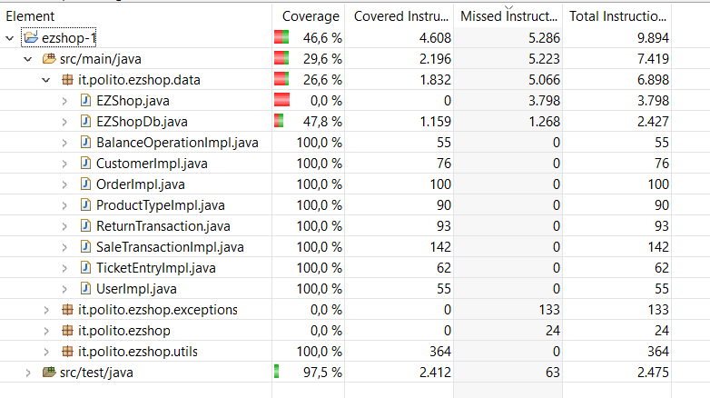

# Unit Testing Documentation

Authors:

Date:

Version:

# Contents

- [Black Box Unit Tests](#black-box-unit-tests)

- [White Box Unit Tests](#white-box-unit-tests)

# Black Box Unit Tests

    <Define here criteria, predicates and the combination of predicates for each function of each class.
    Define test cases to cover all equivalence classes and boundary conditions.
    In the table, report the description of the black box test case and (traceability) the correspondence with the JUnit test case writing the
    class and method name that contains the test case>
    <JUnit test classes must be in src/test/java/it/polito/ezshop   You find here, and you can use,  class TestEzShops.java that is executed
    to start tests
    >

### **Class _Utils_ - method _validateBarcode_**

**Criteria for method _validateBarcode_:**

- Validity of string parameter
- Check digit algorithm successful

**Predicates for method _validateBarcode_:**

| Criteria                         | Predicate |
| -------------------------------- | --------- |
| Validity of string parameter     | Valid     |
|                                  | NULL      |
| check digit algorithm successful | true      |
|                                  | false     |

**Boundaries**:

Boundaries for method validateBarcode:

| Criteria | Boundary values |
| -------- | --------------- |
| -        | -               |

**Combination of predicates**:

Combination of predicates for method validateBarcode

| Validity of string parameter | check digit algorithm successful | Valid / Invalid | Description of the test case         | JUnit test case    |
| ---------------------------- | -------------------------------- | --------------- | ------------------------------------ | ------------------ |
| Valid                        | true                             | Valid           | T1(8032817681723) -> true            | testValidBarcode   |
| ''                           | false                            | Valid           | T2(45218642842) -> false             | testInvalidBarcode |
| Null                         | -                                | Invalid         | T3(null)->throw NullPointerException | testInvalidBarcode |

### **Class _Utils _ - method _isOnlyDigit_**

**Criteria for method _isOnlyDigit_:**

## -Presence of only digit in the string

-
-
- **Predicates for method _isOnlyDigit_:**

| Criteria                     | Predicate |
| ---------------------------- | --------- |
| only digit in string         | true      |
|                              | false     |
| Validity of string parameter | Valid     |
|                              | NULL      |
|                              |           |
|                              |           |

**Boundaries**:

Boundaries for method isOnlyDigit:

| Criteria | Boundary values |
| -------- | --------------- |
| -        | -               |

**Combination of predicates**:

Combination of predicates for method isOnlyDigit

| only digit in string | validity of string parameter | Valid / Invalid | Description of the test case         | JUnit test case  |
| -------------------- | ---------------------------- | --------------- | ------------------------------------ | ---------------- |
| true                 | Valid                        | Valid           | T1("12356344")->true                 | testOnlyDigit    |
| false                | Valid                        | Valid           | T2("134r23")->false                  | testNotOnlyDigit |
| -                    | NULL                         | Invalid         | T3(NULL)->throw NullPointerException | testNotOnlyDigit |

### **Class _Utils_ - method _validateCreditCard_**

**Criteria for method _validateCreditCard_:**

- Validity of string parameter
- Number follows the Luhn algorithm

- **Predicates for method _validateCreditCard_:**

| Criteria                          | Predicate |
| --------------------------------- | --------- |
| Validity of string parameter      | Valid     |
|                                   | NULL      |
| Number follows the Luhn algorithm | true      |
|                                   | false     |

**Boundaries**:

Boundaries for method validateCreditCard:

| Criteria | Boundary values |
| -------- | --------------- |

**Combination of predicates**:

Combination of predicates for method validateCreditCard

| Validity of string parameter | Number follows the Luhn algorithm | Valid / Invalid | Description of the test case         | JUnit test case             |
| ---------------------------- | --------------------------------- | --------------- | ------------------------------------ | --------------------------- |
| NULL                         | \*                                | Invalid         | T1(NULL)->throw NullPointerException | testInvalidLuhnCreditCard() |
| Valid                        | true                              | Valid           | T2("5255189604838575") -> true       | testValidLuhnCreditCard()   |
| "                            | false                             | "               | T3("52551896075") -> false           | testInvalidLuhnCreditCard() |

### **Class _Utils _ - method _containsProduct_**

**Criteria for method _containsProduct_:**

- Validity of List\<TicketEntry>
- existence of the product in the list

**Predicates for method _containsProduct_:**

| Criteria                             | Predicate |
| ------------------------------------ | --------- |
| Validity of List\<TicketEntry>       | Valid     |
|                                      | NULL      |
| existence of the product in the list | yes       |
|                                      | no        |

**Boundaries**:

Boundaries for method containsProduct:

| Criteria | Boundary values |
| -------- | --------------- |
| -        | -               |

**Combination of predicates**:

Combination of predicates for method containsProduct

| Validity of List\<TicketEntry> | existence of the product in the list | Valid / Invalid | Description of the test case                          | JUnit test case          |
| ------------------------------ | ------------------------------------ | --------------- | ----------------------------------------------------- | ------------------------ |
| Valid                          | yes                                  | Valid           | T1("item19,item20,item21","65164684113337")->True     | testContainsProduct      |
| ''                             | no                                   | Valid           | T2("item35,item33,item34","65164684113337")->False    | testDoesntContainProduct |
| NULL                           | -                                    | Invalid         | T3(NULL,"65164684113337")->throw NullPointerException | testDoesntContainProduct |

### **Class _Utils _ - method _getProductFromEntries_**

**Criteria for method _getProductFromEntries_:**

- Validity of List\<TicketEntry>

- Existence of the product in the list

**Predicates for method _getProductFromEntries_:**

| Criteria                             | Predicate |
| ------------------------------------ | --------- |
| Validity of List\<TicketEntry>       | Valid     |
|                                      | NULL      |
| Validity of product code String      | Valid     |
|                                      | NULL      |
| Existence of the product in the list | yes       |
|                                      | no        |

**Boundaries**:

Boundaries for method getProductFromEntries:

| Criteria | Boundary values |
| -------- | --------------- |
| -        | -               |

**Combination of predicates**:

Combination of predicates for method getProductFromEntries

| Validity of List\<TicketEntry> | Validity of product code String | Existence of the product in the list | Valid / Invalid | Description of the test case                                              | JUnit test case             |
| ------------------------------ | ------------------------------- | ------------------------------------ | --------------- | ------------------------------------------------------------------------- | --------------------------- |
| Valid                          | Valid                           | yes                                  | Valid           | T0("item19,item20,item21","65164684113337")-> TicketEntry                 | testGetProductFromEntries() |
| ''                             | NULL                            | -                                    | Invalid         | T1("item19,item20,item21",NULL)->throw NoSuchElementException             | testGetProductFromEntries() |
| ''                             | Valid                           | no                                   | Invalid         | T2("item35,item33,item34","65164684113337")->throw NoSuchElementException | testGetProductFromEntries() |
| Invalid                        | \*                              | \*                                   | Invalid         | T3(NULL,"65164684113337")->throw NullPointerException                     | testGetProductFromEntries() |

### **Class _Utils _ - method _fromFile_**

**Criteria for method _fromFile_:**

- Validity of the String parameter

- Length of the String
- Existence of the Credit Card

  **Predicates for method _fromFile_:**
  | Criterion | Predicate |
  | -------- | --------- |
  | Validity of the String parameter | Valid |
  | | NULL |
  | Length of the String | > 0 |
  | | = 0 ("") |
  | Existence of the Credit Card | Yes |
  | | No |

**Boundaries**:

Boundaries for method fromFile:

| Criteria | Boundary values |
| -------- | --------------- |

**Combination of predicates**:

Combination of predicates for method fromFile

| Validity of the String parameter | Length of the String | Existence of the Credit Card | Valid/Invalid | Description of the test case: example of input and output | JUnit test case              |
| -------------------------------- | -------------------- | ---------------------------- | ------------- | --------------------------------------------------------- | ---------------------------- |
| Valid                               | ''                   | Yes                          | Valid         | T1 -> True                                                | testRegisteredCreditCard()   |
| ''                               | ''                   | No                           | Valid         | T2 -> False                                               | testUnregisteredCreditCard() |
| "                                | 0                    | -                            | Valid         | T3 -> False                        | testUnregisteredCreditCard() |
| NULL                             | -                    | -                            | Invalid       | T4(NULL; throw NullPointerException)                      | testUnregisteredCreditCard() |

### **Class _Utils _ - method _updateFile_**

**Criteria for method _updateFile_:**

- Validity of the String parameter
- Length of the String
- Existence of the Credit Card

  **Predicates for method _updateFile_:**

| Criterion                        | Predicate |
| -------------------------------- | --------- |
| Validity of the String parameter | Valid     |
|                                  | NULL      |
| Length of the String             | > 0       |
|                                  | = 0 ("")  |
| Existence of the Credit Card     | Yes       |
|                                  | No        |

**Boundaries**:

Boundaries for method updateFile:

| Criteria | Boundary values |
| -------- | --------------- |
| -        | -               |

**Combination of predicates**:

Combination of predicates for method updateFile

| Validity of the String parameter | Length of the String | Existence of the Credit Card | Valid/Invalid | Description of the test case: example of input and output | JUnit test case         |
| -------------------------------- | -------------------- | ---------------------------- | ------------- | --------------------------------------------------------- | ----------------------- |
| Valid                            | ''                   | Yes                          | Valid         | T1 -> True                                                | testValidUpdateFile()   |
| ''                               | ''                   | No                           | Valid         | T3 -> False                                               | testInvalidUpdateFile() |
| "                                | 0                    | -                            | Invalid       | T4 -> False                       | testInvalidUpdateFile() |
| NULL                             | -                    | -                            | Invalid       | T5(NULL; throw NullPointerException)                      | testInvalidUpdateFile() |

### **Class _BalanceOperation_ - method _setBalanceId_**

**Criteria for method _setBalanceId_:**

**Predicates for method _setBalanceId_:**

| Criteria | Predicate |
| -------- | --------- |
|          |           |

**Boundaries**:

Boundaries for method setBalanceId:

| Criteria | Boundary values |
| -------- | --------------- |
|          |                 |

**Combination of predicates**:

Combination of predicates for method setBalanceId

| Criteria 1 | Valid / Invalid | Description of the test case     | JUnit test case       |
| ---------- | --------------- | -------------------------------- | --------------------- |
| /          | Valid           | balanceOperation.setBalanceId(2) | testGetSetBalanceId() |

### **Class _BalanceOperation_ - method _setDate_**

**Criteria for method _setDate_:**

**Predicates for method _setDate_:**

| Criteria | Predicate |
| -------- | --------- |
|          |           |

**Boundaries**:

Boundaries for method setDate:

| Criteria | Boundary values |
| -------- | --------------- |
|          |                 |

**Combination of predicates**:

Combination of predicates for method setDate

| Criteria 1 | Valid / Invalid | Description of the test case           | JUnit test case  |
| ---------- | --------------- | -------------------------------------- | ---------------- |
| /          | Valid           | balanceOperation.setDate("2020-10-05") | testGetSetDate() |

### **Class _BalanceOperation_ - method _setMoney_**

**Criteria for method _setMoney_:**

**Predicates for method _setMoney_:**

| Criteria | Predicate |
| -------- | --------- |
|          |           |

**Boundaries**:

Boundaries for method setMoney:

| Criteria | Boundary values |
| -------- | --------------- |
|          |                 |

**Combination of predicates**:

Combination of predicates for method setMoney

| Criteria 1 | Valid / Invalid | Description of the test case    | JUnit test case   |
| ---------- | --------------- | ------------------------------- | ----------------- |
| /          | Valid           | balanceOperation.setMoney(50.5) | testGetSetMoney() |

### **Class _BalanceOperation_ - method _setType_**

**Criteria for method _setType_:**

**Predicates for method _setType_:**

| Criteria | Predicate |
| -------- | --------- |
|          |           |

**Boundaries**:

Boundaries for method setType:

| Criteria | Boundary values |
| -------- | --------------- |
|          |                 |

**Combination of predicates**:

Combination of predicates for method setType

| Criteria 1 | Valid / Invalid | Description of the test case       | JUnit test case  |
| ---------- | --------------- | ---------------------------------- | ---------------- |
| /          | Valid           | balanceOperation.setType("CREDIT") | testGetSetType() |

### **Class _User_ - method _setId_**

**Criteria for method _setId_:**

**Predicates for method _setId_:**

| Criteria | Predicate |
| -------- | --------- |
|          |           |

**Boundaries**:

Boundaries for method setId:

| Criteria | Boundary values |
| -------- | --------------- |
|          |                 |

**Combination of predicates**:

Combination of predicates for method setId

| Criteria 1 | Valid / Invalid | Description of the test case | JUnit test case |
| ---------- | --------------- | ---------------------------- | --------------- |
| /          | Valid           | user.setId(5)                | testSetGetId()  |

### **Class _User_ - method _setUsername_**

**Criteria for method _setUsername_:**

**Predicates for method _setUsername_:**

| Criteria | Predicate |
| -------- | --------- |
|          |           |

**Boundaries**:

Boundaries for method setUsername:

| Criteria | Boundary values |
| -------- | --------------- |
|          |                 |

**Combination of predicates**:

Combination of predicates for method setUsername

| Criteria 1 | Valid / Invalid | Description of the test case | JUnit test case      |
| ---------- | --------------- | ---------------------------- | -------------------- |
| /          | Valid           | user.setUsername("Mary")     | testSetGetUsername() |

### **Class _User_ - method \_setPassword**

**Criteria for method \_setPassword:**

**Predicates for method \_setPassword:**

| Criteria | Predicate |
| -------- | --------- |
|          |           |

**Boundaries**:

Boundaries for method setPassword:

| Criteria | Boundary values |
| -------- | --------------- |
|          |                 |

**Combination of predicates**:

Combination of predicates for method setPassword

| Criteria 1 | Valid / Invalid | Description of the test case | JUnit test case      |
| ---------- | --------------- | ---------------------------- | -------------------- |
| /          | Valid           | user.setPassword("Polito")   | testSetGetPassword() |

### **Class _User_ - method \_setRole**

**Criteria for method \_setRole:**

**Predicates for method \_setRole:**

| Criteria | Predicate |
| -------- | --------- |
|          |           |

**Boundaries**:

Boundaries for method setRole:

| Criteria | Boundary values |
| -------- | --------------- |
|          |                 |

**Combination of predicates**:

Combination of predicates for method setRole

| Criteria 1 | Valid / Invalid | Description of the test case  | JUnit test case  |
| ---------- | --------------- | ----------------------------- | ---------------- |
| /          | Valid           | user.setRole("Administrator") | testSetGetRole() |

### **Class _Customer_ - method _setCustomerName_**

**Criteria for method _setCustomerName_:**

**Predicates for method _setCustomerName_:**

| Criteria | Predicate |
| -------- | --------- |
|          |           |

**Boundaries**:

Boundaries for method setCustomerName:

| Criteria | Boundary values |
| -------- | --------------- |
|          |                 |

**Combination of predicates**:

Combination of predicates for method setCustomerName

| Criteria 1 | Valid / Invalid | Description of the test case | JUnit test case          |
| ---------- | --------------- | ---------------------------- | ------------------------ |
| /          | Valid           | user.setCustomerName("Mary") | testSetGetCustomerName() |

### **Class _Customer_ - method _setCustomerCard_**

**Criteria for method _setCustomerCard_:**

**Predicates for method _setCustomerCard_:**

| Criteria | Predicate |
| -------- | --------- |
|          |           |

**Boundaries**:

Boundaries for method setCustomerCard:

| Criteria | Boundary values |
| -------- | --------------- |
|          |                 |

**Combination of predicates**:

Combination of predicates for method setCustomerCard

| Criteria 1 | Valid / Invalid | Description of the test case       | JUnit test case          |
| ---------- | --------------- | ---------------------------------- | ------------------------ |
| /          | Valid           | user.setCustomerCard("0000000026") | testSetGetCustomerCard() |

### **Class _Customer_ - method _setId_**

**Criteria for method _setId_:**

**Predicates for method _setId_:**

| Criteria | Predicate |
| -------- | --------- |
|          |           |

**Boundaries**:

Boundaries for method setId:

| Criteria | Boundary values |
| -------- | --------------- |
|          |                 |

**Combination of predicates**:

Combination of predicates for method setId

| Criteria 1 | Valid / Invalid | Description of the test case | JUnit test case |
| ---------- | --------------- | ---------------------------- | --------------- |
| /          | Valid           | user.setId(2)                | testSetGetId()  |

### **Class _Customer_ - method _setPoints_**

**Criteria for method _setPoints_:**

**Predicates for method _setPoints_:**

| Criteria | Predicate |
| -------- | --------- |
|          |           |

**Boundaries**:

Boundaries for method setPoints:

| Criteria | Boundary values |
| -------- | --------------- |
|          |                 |

**Combination of predicates**:

Combination of predicates for method setPoints

| Criteria 1 | Valid / Invalid | Description of the test case | JUnit test case    |
| ---------- | --------------- | ---------------------------- | ------------------ |
| /          | Valid           | user.setPoints(10)           | testSetGetPoints() |

### **Class _Order_ - method _setBalanceId_**

**Criteria for method _setBalanceId_:**

**Predicates for method _setBalanceId_:**

| Criteria | Predicate |
| -------- | --------- |
|          |           |

**Boundaries**:

Boundaries for method setBalanceId:

| Criteria | Boundary values |
| -------- | --------------- |
|          |                 |

**Combination of predicates**:

Combination of predicates for method setBalanceId

| Criteria 1 | Valid / Invalid | Description of the test case | JUnit test case       |
| ---------- | --------------- | ---------------------------- | --------------------- |
| /          | Valid           | order.setBalanceId(10)       | testGetSetBalanceID() |

### **Class _Order_ - method _setProductCode_**

**Criteria for method _setProductCode_:**

**Predicates for method _setProductCode_:**

| Criteria | Predicate |
| -------- | --------- |
|          |           |

**Boundaries**:

Boundaries for method setProductCode:

| Criteria | Boundary values |
| -------- | --------------- |
|          |                 |

**Combination of predicates**:

Combination of predicates for method setProductCode

| Criteria 1 | Valid / Invalid | Description of the test case    | JUnit test case         |
| ---------- | --------------- | ------------------------------- | ----------------------- |
| /          | Valid           | order.setProductCode("4567890") | testGetSetProductCode() |

### **Class _Order_ - method _setPricePerUnit_**

**Criteria for method _setPricePerUnit_:**

**Predicates for method _setPricePerUnit_:**

| Criteria | Predicate |
| -------- | --------- |
|          |           |

**Boundaries**:

Boundaries for method setPricePerUnit:

| Criteria | Boundary values |
| -------- | --------------- |
|          |                 |

**Combination of predicates**:

Combination of predicates for method setProductCode

| Criteria 1 | Valid / Invalid | Description of the test case | JUnit test case   |
| ---------- | --------------- | ---------------------------- | ----------------- |
| /          | Valid           | order.setPricePerUnit(34)    | testGetSetPrice() |

### **Class _Order_ - method _setQuantity_**

**Criteria for method _setQuantity_:**

**Predicates for method _setQuantity_:**

| Criteria | Predicate |
| -------- | --------- |
|          |           |

**Boundaries**:

Boundaries for method setQuantity:

| Criteria | Boundary values |
| -------- | --------------- |
|          |                 |

**Combination of predicates**:

Combination of predicates for method setQuantity

| Criteria 1 | Valid / Invalid | Description of the test case | JUnit test case      |
| ---------- | --------------- | ---------------------------- | -------------------- |
| /          | Valid           | order.setQuantity(10)        | testGetSetQuantity() |

### **Class _Order_ - method _setStatus_**

**Criteria for method _setStatus_:**

**Predicates for method _setStatus_:**

| Criteria | Predicate |
| -------- | --------- |
|          |           |

**Boundaries**:

Boundaries for method setStatus:

| Criteria | Boundary values |
| -------- | --------------- |
|          |                 |

**Combination of predicates**:

Combination of predicates for method setStatus

| Criteria 1 | Valid / Invalid | Description of the test case | JUnit test case    |
| ---------- | --------------- | ---------------------------- | ------------------ |
| /          | Valid           | order.setStatus("PAYED")     | testGetSetStatus() |

### **Class _Order_ - method _setOrderId_**

**Criteria for method _setOrderId_:**

**Predicates for method _setOrderId_:**

| Criteria | Predicate |
| -------- | --------- |
|          |           |

**Boundaries**:

Boundaries for method setOrderId:

| Criteria | Boundary values |
| -------- | --------------- |
|          |                 |

**Combination of predicates**:

Combination of predicates for method setOrderId

| Criteria 1 | Valid / Invalid | Description of the test case | JUnit test case     |
| ---------- | --------------- | ---------------------------- | ------------------- |
| /          | Valid           | order.setOrderId(10)         | testGetSetOrderID() |

### **Class _TicketEntry_ - method _setBarCode_**

**Criteria for method _setBarCode_:**

**Predicates for method _setBarCode_:**

| Criteria | Predicate |
| -------- | --------- |
|          |           |

**Boundaries**:

Boundaries for method setBarCode:

| Criteria | Boundary values |
| -------- | --------------- |
|          |                 |

**Combination of predicates**:

Combination of predicates for method setBarCode

| Criteria 1 | Valid / Invalid | Description of the test case    | JUnit test case     |
| ---------- | --------------- | ------------------------------- | ------------------- |
| /          | Valid           | ticketEntry.setBarCode("36487") | testGetSetBarCode() |

### **Class _TicketEntry_ - method _setProductDescription_**

**Criteria for method _setProductDescription_:**

**Predicates for method _setProductDescription_:**

| Criteria | Predicate |
| -------- | --------- |
|          |           |

**Boundaries**:

Boundaries for method setProductDescription:

| Criteria | Boundary values |
| -------- | --------------- |
|          |                 |

**Combination of predicates**:

Combination of predicates for method setProductDescription

| Criteria 1 | Valid / Invalid | Description of the test case                   | JUnit test case                |
| ---------- | --------------- | ---------------------------------------------- | ------------------------------ |
| /          | Valid           | ticketEntry.setProductDescription("chocolate") | testGetSetProductDescription() |

### **Class _TicketEntry_ - method _setAmount_**

**Criteria for method _setAmount_:**

**Predicates for method _setAmount_:**

| Criteria | Predicate |
| -------- | --------- |
|          |           |

**Boundaries**:

Boundaries for method setAmount:

| Criteria | Boundary values |
| -------- | --------------- |
|          |                 |

**Combination of predicates**:

Combination of predicates for method setAmount

| Criteria 1 | Valid / Invalid | Description of the test case | JUnit test case      |
| ---------- | --------------- | ---------------------------- | -------------------- |
| /          | Valid           | ticketEntry.setAmount(49)    | testGetSetQuantity() |

### **Class _TicketEntry_ - method _setPricePerUnit_**

**Criteria for method _setPricePerUnit_:**

**Predicates for method _setPricePerUnit_:**

| Criteria | Predicate |
| -------- | --------- |
|          |           |

**Boundaries**:

Boundaries for method setPricePerUnit:

| Criteria | Boundary values |
| -------- | --------------- |
|          |                 |

**Combination of predicates**:

Combination of predicates for method setPricePerUnit

| Criteria 1 | Valid / Invalid | Description of the test case    | JUnit test case   |
| ---------- | --------------- | ------------------------------- | ----------------- |
| /          | Valid           | ticketEntry.setPricePerUnit(49) | testGetSetPrice() |

### **Class _TicketEntry_ - method _setDiscountRate_**

**Criteria for method _setDiscountRate_:**

| Criteria | Predicate |
| -------- | --------- |
|          |           |

**Boundaries**:

Boundaries for method _setDiscountRate_:

| Criteria | Boundary values |
| -------- | --------------- |
|          |                 |

**Combination of predicates**:

Combination of predicates for method _setDiscountRate_:

| Criteria 1 | Valid / Invalid | Description of the test case     | JUnit test case          |
| ---------- | --------------- | -------------------------------- | ------------------------ |
| /          | Valid           | ticketEntry.setDiscountRate(0.5) | testGetSetDiscountRate() |

### **Class _ReturnTransaction_ - method _setReturnId_**

**Criteria for method _setReturnId_:**

**Predicates for method _setReturnId_:**

| Criteria | Predicate |
| -------- | --------- |
|          |           |

**Boundaries**:

Boundaries for method _setReturnId_:

| Criteria | Boundary values |
| -------- | --------------- |
|          |                 |

**Combination of predicates**:

Combination of predicates for method _setReturnId_:

| Criteria 1 | Valid / Invalid | Description of the test case   | JUnit test case      |
| ---------- | --------------- | ------------------------------ | -------------------- |
| /          | Valid           | saleTransaction.setReturnId(5) | testGetSetReturnId() |

### **Class _ReturnTransaction_ - method _setTransactionId_**

**Criteria for method _setTransactionId_:**

**Predicates for method _setTransactionId_:**

| Criteria | Predicate |
| -------- | --------- |
|          |           |

**Boundaries**:

Boundaries for method _setTransactionId_:

| Criteria | Boundary values |
| -------- | --------------- |
|          |                 |

**Combination of predicates**:

Combination of predicates for method _setTransactionId_:

| Criteria 1 | Valid / Invalid | Description of the test case        | JUnit test case           |
| ---------- | --------------- | ----------------------------------- | ------------------------- |
| /          | Valid           | saleTransaction.setTransactionId(5) | testGetsetTransactionId() |

### **Class _ReturnTransaction_ - method _setReturnedProductMap_**

**Criteria for method _setReturnedProductMap_:**

**Predicates for method _setReturnedProductMap_:**

| Criteria | Predicate |
| -------- | --------- |
|          |           |

**Boundaries**:

Boundaries for method _setReturnedProductMap_:

| Criteria | Boundary values |
| -------- | --------------- |
|          |                 |

**Combination of predicates**:

Combination of predicates for method _setReturnedProductMap_:

| Criteria 1 | Valid / Invalid | Description of the test case               | JUnit test case                |
| ---------- | --------------- | ------------------------------------------ | ------------------------------ |
| /          | Valid           | saleTransaction.setReturnedProductMap(map) | testGetsetReturnedProductMap() |

### **Class _ReturnTransaction_ - method _addProductToReturn_**

**Criteria for method _addProductToReturn_:**

**Predicates for method _addProductToReturn_:**

| Criteria | Predicate |
| -------- | --------- |
|          |           |

**Boundaries**:

Boundaries for method _addProductToReturn_:

| Criteria | Boundary values |
| -------- | --------------- |
|          |                 |

**Combination of predicates**:

Combination of predicates for method _addProductToReturn_:

| Criteria 1 | Valid / Invalid | Description of the test case                            | JUnit test case             |
| ---------- | --------------- | ------------------------------------------------------- | --------------------------- |
| /          | Valid           | saleTransaction.addProductToReturn("65164684113337", 1) | testGetAddProductToReturn() |

### **Class _ReturnTransaction_ - method _setStatus_**

**Criteria for method _setStatus_:**

**Predicates for method _setStatus_:**

| Criteria | Predicate |
| -------- | --------- |
|          |           |

**Boundaries**:

Boundaries for method _setStatus_:

| Criteria | Boundary values |
| -------- | --------------- |
|          |                 |

**Combination of predicates**:

Combination of predicates for method _setStatus_:

| Criteria 1 | Valid / Invalid | Description of the test case        | JUnit test case    |
| ---------- | --------------- | ----------------------------------- | ------------------ |
| /          | Valid           | saleTransaction.setStatus("CLOSED") | testGetsetStatus() |

### **Class _ReturnTransaction_ - method _setTotal_**

**Criteria for method _setTotal_:**

**Predicates for method _setTotal_:**

| Criteria | Predicate |
| -------- | --------- |
|          |           |

**Boundaries**:

Boundaries for method _setTotal_:

| Criteria | Boundary values |
| -------- | --------------- |
|          |                 |

**Combination of predicates**:

Combination of predicates for method _setTotal_:

| Criteria 1 | Valid / Invalid | Description of the test case | JUnit test case   |
| ---------- | --------------- | ---------------------------- | ----------------- |
| /          | Valid           | saleTransaction.setTotal(10) | testGetsetTotal() |

### **Class _ReturnTransaction_ - method _updateTotal_**

**Criteria for method _updateTotal_:**

**Predicates for method _updateTotal_:**

| Criteria | Predicate |
| -------- | --------- |
|          |           |

**Boundaries**:

Boundaries for method _updateTotal_:

| Criteria | Boundary values |
| -------- | --------------- |
|          |                 |

**Combination of predicates**:

Combination of predicates for method _updateTotal_:

| Criteria 1 | Valid / Invalid | Description of the test case    | JUnit test case      |
| ---------- | --------------- | ------------------------------- | -------------------- |
| /          | Valid           | saleTransaction.updateTotal(10) | testGetupdateTotal() |

### **Class _SaleTransaction_ - method _setTicketNumber_**

**Criteria for method _setTicketNumber_:**

**Predicates for method _setTicketNumber_:**

| Criteria | Predicate |
| -------- | --------- |
|          |           |

**Boundaries**:

Boundaries for method _setTicketNumber_:

| Criteria | Boundary values |
| -------- | --------------- |
|          |                 |

**Combination of predicates**:

Combination of predicates for method _setTicketNumber_:

| Criteria 1 | Valid / Invalid | Description of the test case       | JUnit test case          |
| ---------- | --------------- | ---------------------------------- | ------------------------ |
| /          | Valid           | saleTransaction.setTicketNumber(2) | testGetsetTicketNumber() |

### **Class _SaleTransaction_ - method _setStatus_**

**Criteria for method _setStatus_:**

**Predicates for method _setStatus_:**

| Criteria | Predicate |
| -------- | --------- |
|          |           |

**Boundaries**:

Boundaries for method setStatus:

| Criteria | Boundary values |
| -------- | --------------- |
|          |                 |

**Combination of predicates**:

Combination of predicates for method setStatus

| Criteria 1 | Valid / Invalid | Description of the test case       | JUnit test case    |
| ---------- | --------------- | ---------------------------------- | ------------------ |
| /          | Valid           | saleTransaction.setStatus("PAYED") | testGetSetStatus() |

### **Class _SaleTransaction_ - method _setDiscountRate_**

**Criteria for method _setDiscountRate_:**

| Criteria | Predicate |
| -------- | --------- |
|          |           |

**Boundaries**:

Boundaries for method _setDiscountRate_:

| Criteria | Boundary values |
| -------- | --------------- |
|          |                 |

**Combination of predicates**:

Combination of predicates for method _setDiscountRate_:

| Criteria 1 | Valid / Invalid | Description of the test case         | JUnit test case          |
| ---------- | --------------- | ------------------------------------ | ------------------------ |
| /          | Valid           | saleTransaction.setDiscountRate(0.5) | testGetSetDiscountRate() |

### **Class _SaleTransaction_ - method _setPrice_**

**Criteria for method _setPrice_:**

| Criteria | Predicate |
| -------- | --------- |
|          |           |

**Boundaries**:

Boundaries for method _setPrice_:

| Criteria | Boundary values |
| -------- | --------------- |
|          |                 |

**Combination of predicates**:

Combination of predicates for method _setPrice_:

| Criteria 1 | Valid / Invalid | Description of the test case | JUnit test case   |
| ---------- | --------------- | ---------------------------- | ----------------- |
| /          | Valid           | saleTransaction.setPrice(5)  | testGetSetPrice() |

### **Class _SaleTransaction_ - method _testSetGetEntries_**

**Criteria for method _testSetGetEntries_:**

| Criteria | Predicate |
| -------- | --------- |
|          |           |

**Boundaries**:

Boundaries for method _testSetGetEntries_:

| Criteria | Boundary values |
| -------- | --------------- |
|          |                 |

**Combination of predicates**:

Combination of predicates for method _testSetGetEntries_:

| Criteria 1 | Valid / Invalid | Description of the test case      | JUnit test case     |
| ---------- | --------------- | --------------------------------- | ------------------- |
| /          | Valid           | saleTransaction.setEntries(tlist) | testSetGetEntries() |

### **Class _SaleTransaction_ - method _testEstimatePrice_**

**Criteria for method _testEstimatePrice_:**

| Criteria | Predicate |
| -------- | --------- |
|          |           |

**Boundaries**:

Boundaries for method _testEstimatePrice_:

| Criteria | Boundary values |
| -------- | --------------- |
|          |                 |

**Combination of predicates**:

Combination of predicates for method _testEstimatePrice_:

| Criteria 1 | Valid / Invalid | Description of the test case    | JUnit test case     |
| ---------- | --------------- | ------------------------------- | ------------------- |
| /          | Valid           | saleTransaction.estimatePrice() | testEstimatePrice() |

# White Box Unit Tests

### Test cases definition

    <JUnit test classes must be in src/test/java/it/polito/ezshop>
    <Report here all the created JUnit test cases, and the units/classes under test >
    <For traceability write the class and method name that contains the test case>

| Unit name |                      JUnit test case |                  Java Class |
| --------: | -----------------------------------: | --------------------------: |
|     Utils |                   WBtestInvalidLengthBarCode() |                   UtilsTest |
|     Utils |                   WBtestInvalidDigitBarCode() |                   UtilsTest |
|     Utils |               WBtestInvalidLengthCreditCard() |                   UtilsTest |
|     Utils |                    WBtestInvalidAmountCreditCard() |                   UtilsTest |
|     Utils |                   WBtestInvalidUFile() |                   UtilsTest |
|  EZShopDB |                    testUpdateOrder() |              TestR9_OrderDb |
|  EZShopDB |             testInvalidUpdateOrder() |              TestR9_OrderDb |
|  EZShopDB |                  testGetUserbyName() |              TestR10_UserDb |
|  EZShopDB |           testInvalidGetUserbyName() |              TestR10_UserDb |
|  EZShopDB |               testUpdateUserRights() |              TestR10_UserDb |
|  EZShopDB |        testInvalidUpdateUserRights() |              TestR10_UserDb |
|  EZShopDB |                     testDeleteUser() |              TestR10_UserDb |
|  EZShopDB |              testInvalidDeleteUser() |              TestR10_UserDb |
|  EZShopDB |              testInvalidInsertCard() |          TestR11_CustomerDb |
|  EZShopDB |                 testUpdateCustomer() |          TestR11_CustomerDb |
|  EZShopDB |          testInvalidUpdateCustomer() |          TestR11_CustomerDb |
|  EZShopDB |                   testCustomerCard() |          TestR11_CustomerDb |
|  EZShopDB |         testInvalidGetCustomerCard() |          TestR11_CustomerDb |
|  EZShopDB |       testValidRecordBalanceUpdate() |  TestR12_BalanceOperationDb |
|  EZShopDB |     testInvalidRecordBalanceUpdate() |  TestR12_BalanceOperationDb |
|  EZShopDB |   testValidDeleteReturnTransaction() | TestR14_ReturnTransactionDb |
|  EZShopDB | testInvalidDeleteReturnTransaction() | TestR14_ReturnTransactionDb |
|  EZShopDB |    testValidNewReturnTransactionId() | TestR14_ReturnTransactionDb |
|  EZShopDB |  testInvalidNewReturnTransactionId() | TestR14_ReturnTransactionDb |
|  EZShopDB |     testValidUpdateSaleTransaction() |   TestR15_SaleTransactionDb |
|  EZShopDB |   testInvalidUpdateSaleTransaction() |   TestR15_SaleTransactionDb |
|  EZShopDB |     testValidDeleteSaleTransaction() |   TestR15_SaleTransactionDb |
|  EZShopDB |   testInvalidDeleteSaleTransaction() |   TestR15_SaleTransactionDb |
|  EZShopDB |     testValidPayForSaleTransaction() |   TestR15_SaleTransactionDb |
|  EZShopDB |   testInvalidPayForSaleTransaction() |   TestR15_SaleTransactionDb |
|  EZShopDB |           testValidSetSaleDiscount() |   TestR15_SaleTransactionDb |
|  EZShopDB |         testInvalidSetSaleDiscount() |   TestR15_SaleTransactionDb |
|  EZShopDB |      testValidNewSaleTransactionId() |   TestR15_SaleTransactionDb |
|  EZShopDB |    testInvalidNewSaleTransactionId() |   TestR15_SaleTransactionDb |
|  EZShopDB |                     testUpdateProd() |       TestR16_ProductTypeDb |
|  EZShopDB |              testInvalidUpdateProd() |       TestR16_ProductTypeDb |
|  EZShopDB |                    testUpdateQuant() |       TestR16_ProductTypeDb |
|  EZShopDB |             testInvalidUpdateQuant() |       TestR16_ProductTypeDb |
|  EZShopDB |          testInvalidUpdatePosition() |       TestR16_ProductTypeDb |
|  EZShopDB |                       testPosition() |       TestR16_ProductTypeDb |
|  EZShopDB |        testInvalidExistingPosition() |       TestR16_ProductTypeDb |
|  EZShopDB |                     testDeleteProd() |       TestR16_ProductTypeDb |
|  EZShopDB |              testInvalidDeleteProd() |       TestR16_ProductTypeDb |

### Code coverage report

### Loop coverage analysis

    <Identify significant loops in the units and reports the test cases
    developed to cover zero, one or multiple iterations >

| Unit name  | Loop rows | Number of iterations | JUnit test case           |
| ---------- | --------- | -------------------- | ------------------------- |
| Utils.java | 21-29     | 0                    | testInvalidBarcode        |
| Utils.java | 21-29     | code.length() - 2    | testValidBarcode          |
| Utils.java | 21-29     | code.length() - 2    | testValidBarcode          |
| Utils.java | 53-61     | 0                    | testInvalidLuhnCreditCard |
| Utils.java | 53-61     | number.length()-1    | testInvalidLuhnCreditCard |
| Utils.java | 53-61     | number.length()-1    | testValidLuhnCreditCard   |
